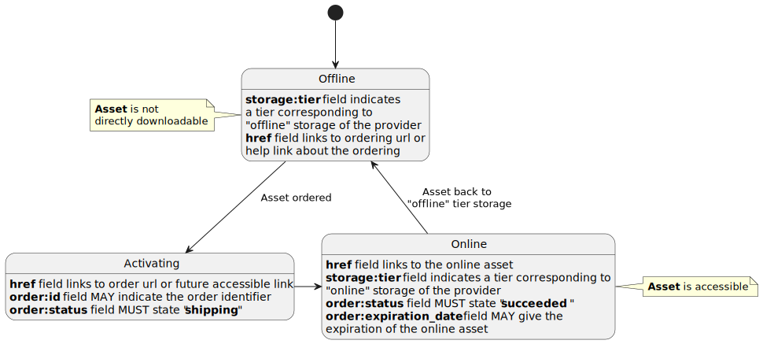

# Order Extension Specification

- **Title:** Order
- **Identifier:** <https://stac-extensions.github.io/order/v1.0.0/schema.json>
- **Field Name Prefix:** order
- **Scope:** Item, Collection
- **Extension [Maturity Classification](https://github.com/radiantearth/stac-spec/tree/master/extensions/README.md#extension-maturity):** Proposal
- **Owner**: @emmanuelmathot

This document explains the Order Extension to the [SpatioTemporal Asset Catalog](https://github.com/radiantearth/stac-spec) (STAC) specification.
This extension allows assets ordering management within STAC specification.

- Examples:
  - [Item example](examples/item.json): Shows the basic usage of the extension in a STAC Item
  - [Collection example](examples/collection.json): Shows the basic usage of the extension in a STAC Collection
- [JSON Schema](json-schema/schema.json)
- [Changelog](./CHANGELOG.md)

## Ordering Scenarios

This extension can be used to enable several ordering scenarios. Some examples are described in the following sections

### Activating Offline Assets

This scenario describes the "activation" of an *offline* product at the provider storage. It uses the [storage extension](https://github.com/stac-extensions/storage) to describe storage information necessary for the ordering status. The following diagram describe the states transition of the asset in a STAC Item.



### Data Ordering per user

This scenario describes the "ordering" of data product by a free or commercial provider. This use case is based on a per-user exchange with the provider for an individual service. The order information is not stored as a metadata of the Item but in the ordering information of the user request.


## Item Properties or Collections and Asset Fields

The fields in the table below can be used in these parts of STAC documents:
- [x] Catalogs
- [x] Collections
- [x] Item Properties (incl. Summaries in Collections)
- [x] Assets (for both Collections and Items, incl. Item Asset Definitions in Collections)
- [ ] Links

| Field Name            | Type     | Description                                                                                     |
| --------------------- | -------- | ----------------------------------------------------------------------------------------------- |
| order:status          | string   | **REQUIRED**. Describe the status of the ordering. One of the value listed [here](#orderstatus) |
| order:id              | string   | Optional identifier of the order                                                                |
| order:date            | datetime | indicates the order time                                                                        |
| order:expiration_date | datetime | indicates the validity time of the order.                                                       |

These fields have different meaning depending on where they are used. When used as an Item properties or top-level Collection field, they refer to an order of all data referenced in the Item or Collection, which may include the metadata itself. When used in an Asset Object, the order refer to the particular data asset linked to in the Asset Object.

### Additional Field Information

#### order:status

The main field describing the order status

- `orderable`: The item or asset is orderable via the provider scenario
- `ordered`: The item or asset is ordered and the provider is preparing to make it available.
- `pending`: The item or asset is ordered but wait for an activation before being able for shipping.
- `shipping` The item or asset order are being processed by the provider to provide you with the asset(s).
- `succeeded`: The provider has delivered your order and asset(s) are available.
- `failed`: The provider is not able to deliver the order.
- `canceled` The order has been canceled.

## Relation types

The following types should be used as applicable `rel` types in the
[Link Object](https://github.com/radiantearth/stac-spec/tree/master/item-spec/item-spec.md#link-object).

| Type  | Description                                                                                                   |
| ----- | ------------------------------------------------------------------------------------------------------------- |
| order | This link points to a document describing further the order (e.g. terms and conditions of the Item provider.) |

## Contributing

All contributions are subject to the
[STAC Specification Code of Conduct](https://github.com/radiantearth/stac-spec/blob/master/CODE_OF_CONDUCT.md).
For contributions, please follow the
[STAC specification contributing guide](https://github.com/radiantearth/stac-spec/blob/master/CONTRIBUTING.md) Instructions
for running tests are copied here for convenience.

### Running tests

The same checks that run as checks on PR's are part of the repository and can be run locally to verify that changes are valid. 
To run tests locally, you'll need `npm`, which is a standard part of any [node.js installation](https://nodejs.org/en/download/).

First you'll need to install everything with npm once. Just navigate to the root of this repository and on 
your command line run:
```bash
npm install
```

Then to check markdown formatting and test the examples against the JSON schema, you can run:
```bash
npm test
```

This will spit out the same texts that you see online, and you can then go and fix your markdown or examples.

If the tests reveal formatting problems with the examples, you can fix them with:
```bash
npm run format-examples
```
